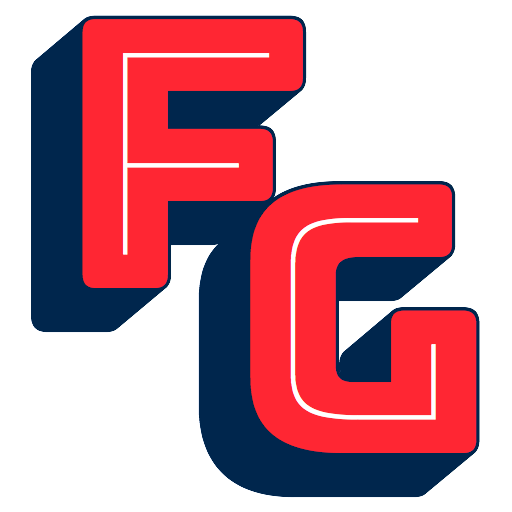

# FontGoggles

FontGoggles was funded by [Google Fonts](https://fonts.google.com/).

FontGoggles is a font viewer desktop app for macOS that supports these file formats:

- `.otf`, `.ttf`, `.otc`, `.ttc`, `.woff`, `.woff2`
- `.ufo`
- `.designspace`
- `.ttx`

It uses HarfBuzz for line layout, so it supports complex scripts. The source formats are partially compiled on the fly, so their line layout and variation behaviour can be realistically previewed.

When a font file changes on disk, FontGoggles will automatically reload it and show the updated version.

For downloads see the [releases page](https://github.com/justvanrossum/fontgoggles/releases).



## Build instructions

If you want to build and run the app from the source, follow these instructions.

- Make sure you have Python 3.7 installed, preferably from python.org, but homebrew may work, too. (3.8 may work, but I didn't check whether all our dependencies are available.)

- Clone this repository.

- `cd` into the repository folder.

- Setup a virtual environment:

	`$ python3.7 -m venv venv --prompt=fontgoggles`

- Activate the environment:

	`$ source venv/bin/activate`

- Update `pip`:

	`$ pip install --upgrade pip`

- Install dependencies:

	`$ pip install -r requirements.txt`

- Install dev dependencies:

	`$ pip install -r requirements-dev.txt`

- Install our lib:

	`$ pip install .`

- Or, if you prefer an editable install of our lib:

	```
	$ pip install -e .
	$ ./Turbo/build_lib.sh
	```

    (The latter step builds a required C library, that otherwise wouldn't get built in editable mode.)

- Run some tests:

	`$ pytest`

- Build the application:

	`$ python App/setup.py py2app`

You'll find the built application in `App/dist/`

Now you can drop some fonts onto the app, or a folder containing fonts.
