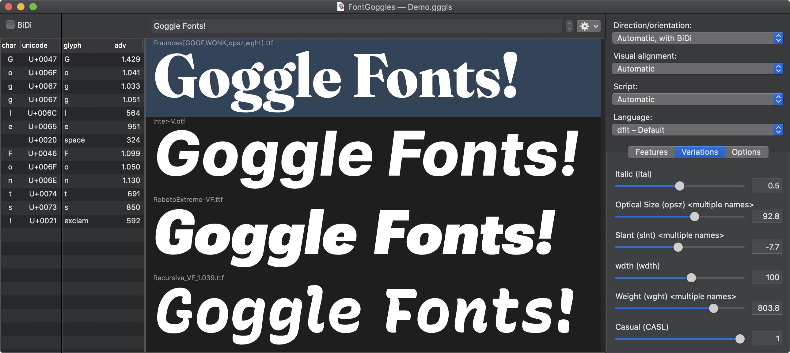
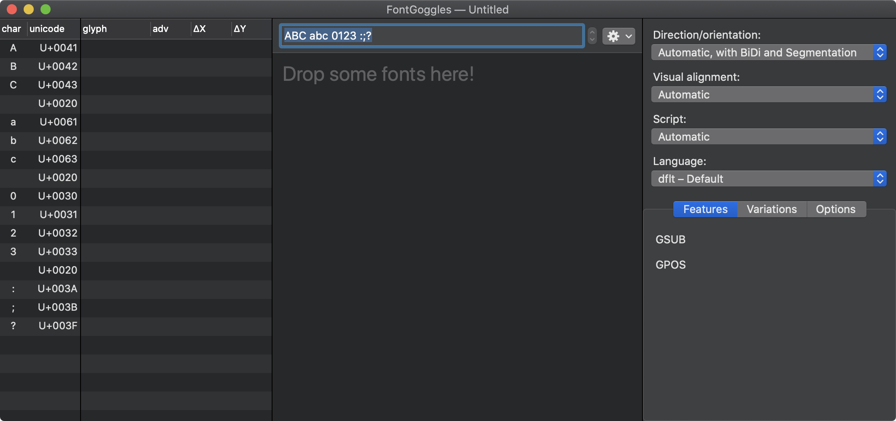
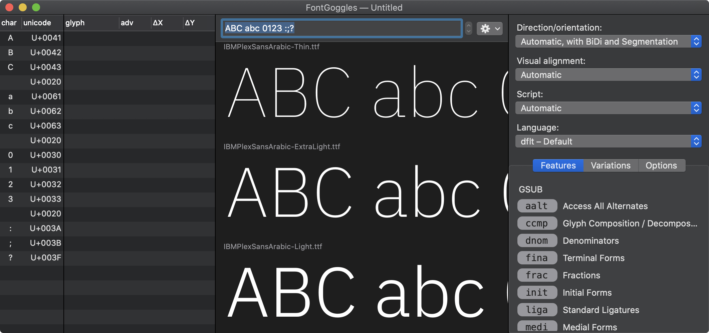
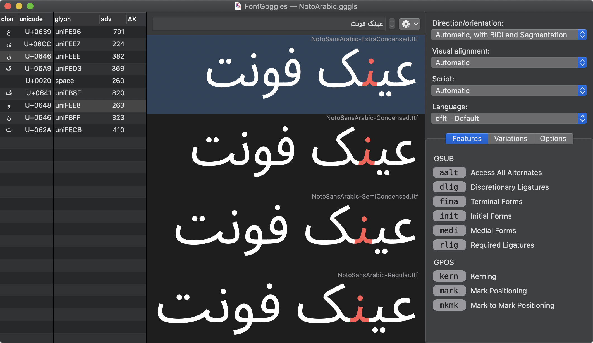
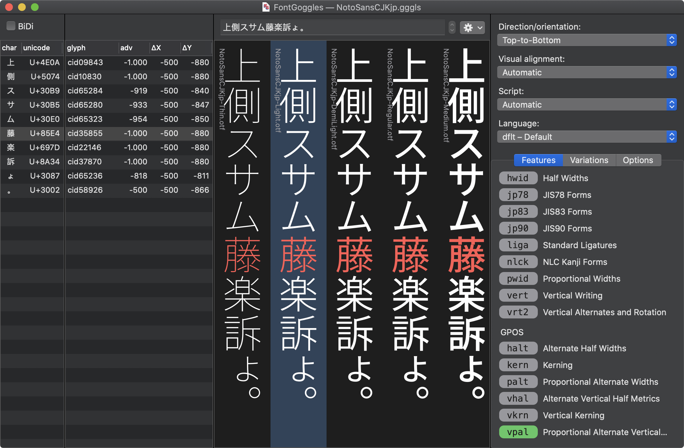
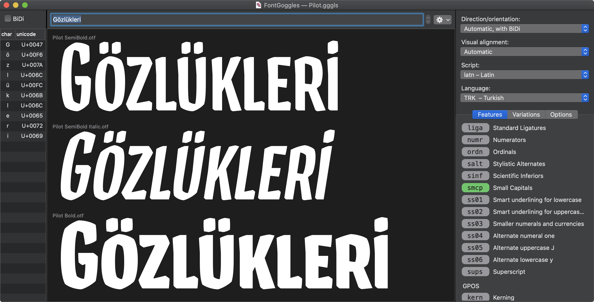
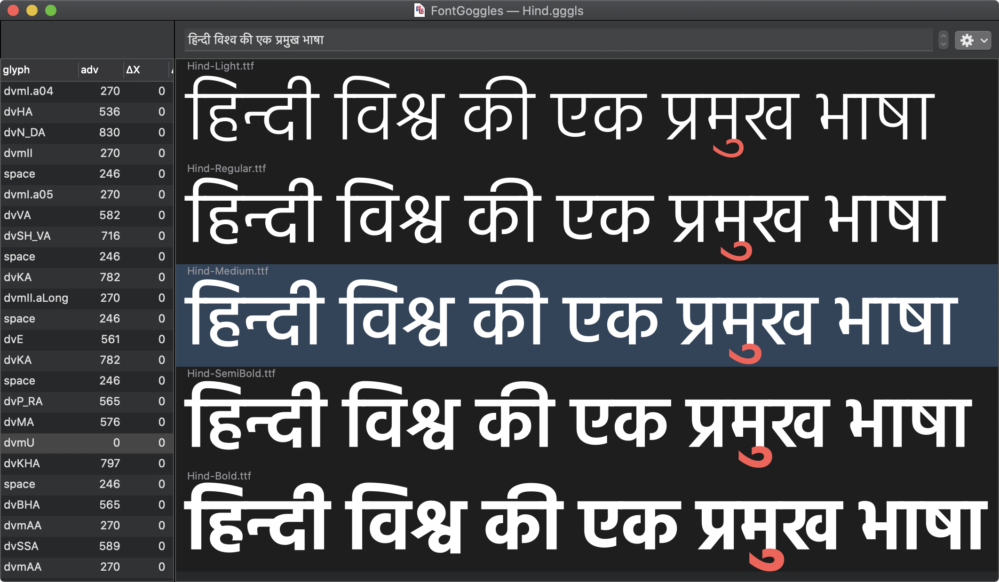
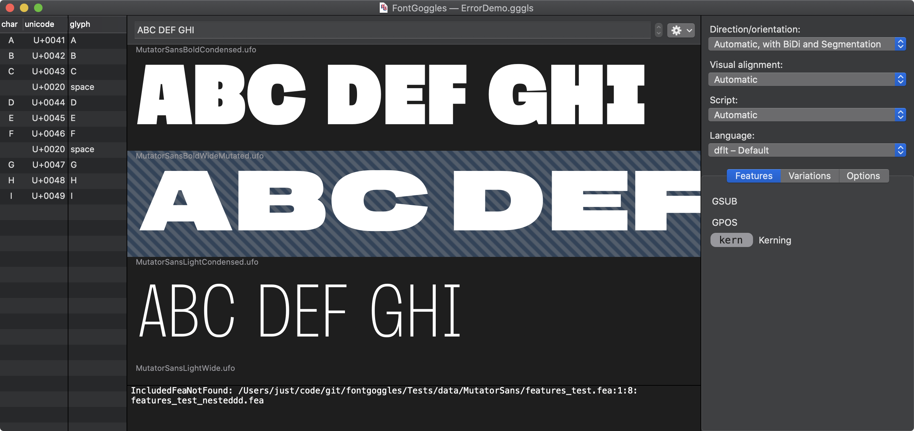
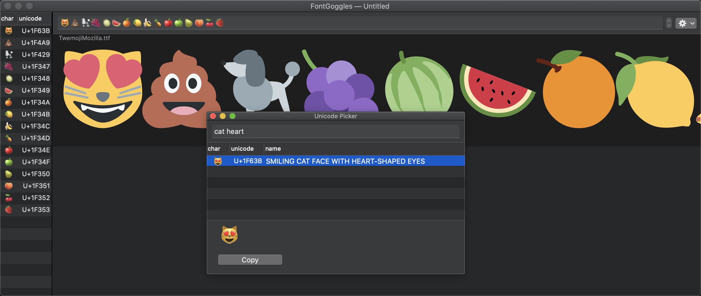

# FontGoggles

_Interactive Previewing and Comparing_

## Overview

FontGoggles is a font viewer for various font formats. It is a desktop
application for macOS. It is free and [open source](https://github.com/justvanrossum/fontgoggles).

The main focus is text behavior, specifically text shaping and variation behavior.

You can download [the latest release here](https://github.com/justvanrossum/fontgoggles/releases/latest).

Homebrew users can install the `fontgoggles` cask with the command `brew install --cask fontgoggles`.

The following font formats are supported:

- .ttf/.otf (including variable fonts and COLR/CPAL-based color fonts)
- .ttc/.otc
- .woff/.woff2
- .ufo/.ufoz
- .designspace
- .ttx

Core features:

- View multiple fonts simultaneously
- Supports complex scripts: it does proper text shaping with HarfBuzz
- Enable/disable OpenType features
- Explore design spaces
- Preview .ufo and .designspace files _as if_ they are compiled fonts
- Automatically reload fonts if they are changed on disk
- Supports vertical text layout

## Testimonials

Agyei Archer: _“🤩🤩🤩”_

Stephen Nixon: _“Super nice! I really love how this lets me compare the same
variable axes across multiple fonts. It’s super interesting to visually
compare how different fonts handle wght, opsz, etc. I also love that I can
put this in my mac dock and drag font files directly onto it, rather than
booting up a browser to test things. And the light/dark modes are right on
point.”_

Thomas Thiemich: _“The most impressive feature of this tool so far is its
speed — it’s quite impressive how fast it handles multiple fonts or variable
fonts.”_

Ben Mitchell: _“I especially like the ability to scale text within the samples
and adjust the baseline, wish other apps were this intuitive.”_

Petr van Blokland: _“FontGoggles works really well. Truly live feature
source code debugging for many masters simultaneously. Awesome.”_

Paul van der Laan (Bold Monday): _“Really impressive! Love the uncluttered
interface. Support for UFO files is fantastic. Being able to instantly
preview a variable font by dropping a designspace file is a BIG help.”_

Arthur Reinders Folmer (Typearture): _“These goggles need no prescription!
FontGoggles shows and compares complex color and variable fonts fast and
fluid, making refinements and adjustments a piece of cake. An amazing
variable color font proofing app for all file formats.”_

Stephen Nixon, two days later: _“WOW. Font Goggles is just so good. It allows
me to open a preview of the full Recursive designspace in maybe 4 or 5
seconds. Way quicker than any other way of checking whether a given
interpolation will work as desired.”_

## How to use

Drop some fonts (or folders with fonts) onto the application, or launch
the application, and drop some fonts onto the window.

A new, empty window looks like this:

After dropping some fonts it will look like this:

- Zoom in/out by using pinch gestures on your trackpad, or use ⌘-plus
  and ⌘-minus, or option-scroll.
- Type text in the text field to change the displayed text
- Drag and drop can be used to rearrange the fonts
- Click on a font to see the glyph positioning information
- Select glyphs by clicking on them, which will highlight glyph
  positioning info and character info
- In the font list, use arrow keys to navigate glyphs and fonts

## The Character and Glyph lists

On the left hand side of the FontGoggles window there are two lists.

The left-most one is the _Character list_, which shows the entered
characters and their Unicode values.

Characters are listed in logical order (first-to-last, in the
natural writing direction of the script).

The second list is the _Glyph list_, which can show information about
the rendered glyphs, such as their names, advance values and positioning.
Since this information is font-specific, it only shows information when
exactly one font is selected (or when only one font has been opened).

The glyphs in the _Glyph list_ are ordered from left to right in _visual_
order, or from top to bottom in vertical mode.

Selecting items in the _Character list_ will reflect the selection in the
_Glyphs list_ and vice versa. A single glyph can belong to multiple
characters (for example in the case of ligatures), or vice versa.

Characters and glyphs are “clustered” by the shaping engine (HarfBuzz),
and the _Glyph list_ contains a column named “cluster” that shows the
cluster number for each glyph. For more in-depth information see the
[HarfBuzz documentation](https://harfbuzz.github.io/clusters.html).
Selecting a character or glyph in one list will select the entire cluster
in the other list.

Both lists can be scrolled horizontally or resized to reveal more information,
and columns can be rearranged by dragging them around.

You can copy information from both _Character_ and _Glyph lists_ by selecting
rows or columns and hit ⌘-C. Select multiple rows or columns by holding
the Command key while clicking further items. For example, click on the
“glyph” header in the _Glyph list_ to select the glyph name column, the hit
⌘-C to copy the sequence of glyph names to the clipboard. If multiple columns
are involved in the selection, the clipboard data will be tab-separated, ready
to be pasted into a spreadsheet.

## The Font list

The _Font list_ is the central section of the FontGoggles window. Font files can be
dropped here, fonts can be selected, rearranged by dragging them around,
or removed from the list with the delete key.

You can control-click on a font to get a contextual menu. The menu item
there is to reveal the font in the Finder.

Fonts can also be dragged to other applications, which is equivalent to
dragging them from the finder. You can also drag and drop fonts between
FontGoggles windows.

## Text settings

At the top right of the FontGoggles window you find four buttons with
popup menus:

- Direction/orientation
- Visual alignment
- Script
- Language

The _Direction/orientation_ menu has six options:

- _Automatic, with BiDi and Segmentation_: apply the Unicode bidirectional
  algorithm, which will determine the dominant writing direction, as well
  as perform segmentation of the string based on runs with the same script
  and the same BiDi level.
- _Automatic, w/o BiDi and Segmentation_: let HarfBuzz guess the writing
  direction and the script of the text, do not applying the Unicode
  bidirectional algorithm, and do not perform segmentation.
- _Left-to-Right_: force the direction of the text to be Left-to-Right
- _Right-to-Left_: force the direction of the text to be Right-to-Left
- _Top-to-Bottom_: use vertical layout, Top-to-Bottom
- _Bottom-to-Top_: use vertical layout, Bottom-to-Top

The _Visual alignment_ button controls how the rendered text is visually
aligned within the window. Its menu has four options:

- _Automatic_: Use the alignment that is most natural with the detected
  writing direction
- _Left_: align left
- _Right_: align right
- _Center_: align center

In vertical mode, the options are _Automatic_, _Top_, _Bottom_ and _Center_.

The _Script_ button overrides the automatic detection of the script by
HarfBuzz.

The _Language_ button allows you to specify for which language any
language-specific lookups will be activated.

## Formatting settings

The _Features_ panel shows the superset of GSUB and GPOS features of
all opened fonts. You can click feature tags to enable them (green),
disable them (red) or use their default setting (gray). Clicking the
tags cycles through the modes (gray → green → red → gray). Holding the
option key reverses the cycling direction (gray → red → green → gray).

For `GSUB` features, you can control-click (right-click) on a feature
tag to get a contextual menu, allowing you to specify an alternate
number for features that expose alternate glyphs, such as `aalt`.

The _Variations_ panel shows sliders for all axes defined in the opened
fonts. The minimum and maximum values for an axis are the lowest and
highest values found in all opened fonts that have that axis.

When multiple variable fonts (and/or .designspace files) are opened,
all axes in all open fonts are set to their respective default values.
However, since this value can be different per font, the slider will
in that case show an arbitrary position, and the numeric field will
be empty as a sign there is not a single possible value.

The _Options_ panel has three sliders and a checkbox that affect the
display of the text:

- The _Relative Size_ slider controls the relative size of the text in
  comparison to the box in which is is displayed. A value of 100 scales
  the Units Per Em value to the display box size.
- The _Baseline_ slider controls the baseline position, as a percentage
  of the display box size.
- The _Margin_ slider controls the left and right margins, as a percentage
  of the display box size. Or top and bottom in vertical layout mode.
- The _Enable Color (COLR/CPAL)_ checkbox allows you to choose whether
  color glyphs are displayed if available.

## Customize the window layout

Most panels in the window are resizable, and some are collapsable.
There are also “View” menu items to show and hide the collapsable
panels:

- Show/hide Character list — ⌘-1
- Show/hide Glyph list — ⌘-2
- Show/hide Compile output — ⌘-3
- Show/hide Formatting options — ⌘-4

With another “View” menu item you can hide or show the font file name labels
in the Font list:

- Show/hide Font File name — ⌘-5

## Load and navigate a text file

Instead of typing the text into the text field, you may load an external
text file, using the “Load Text File...” menu under “View”, or with the
“gear” popup menu next to the text field.

Once loaded, you can navigate through the lines of the text file with
the “stepper” control next to the text field. The “View” menu has shortcuts
for this: ⌘-arrow-key-up and ⌘-arrow-key-down to go to the previous or next
line respectively.

You can keep editing the text file in a text editor while it is loaded in
FontGoggles: it will reload the text file and show the changes.

## Save a project file

You can save a window as a `.gggls` project file. Apart from the viewed
fonts, it will store all text, formatting and window settings.

_Note: The file stores relative paths to the font files, so its location
is related on the location of the font files. They can move together,
but if sources move or the project file moves, the source references in
the project file become invalid._

## Edit a font with another application

If a font gets changed on-disk by another application, FontGoggles will
reload it and show the updated version. For example, this happens, when
you:

- Re-generate a .ttf or .otf from a font editor.
- Edit a .ufo with a font editor
- Edit a .ufo with a text editor
- Edit a .designspace file
- Edit a .fea file associated with a .ufo or .designspace file
- Edit a .ttx file

_Note: FontGoggles does its very best to reload as quickly as possible,
but for .ufo and .designspace it may have to re-compile OpenType
features, and the time needed depends on the complexity of the font._

## Compile warnings and errors

When an error or warning occurs during the loading of a font, the
font list will show that by highlighting the font with a diagonally
striped background. To view the error details, click on the font, and
the compile output panel at the bottom of the font list will appear.

## Unicode Picker

FontGoggles provides its own Unicode Picker, under the “Edit” menu:
“Unicode Picker”, shortcut ⌘-U. It allows you to find a Unicode
character by name.

You can use multiple search terms: each additional term will narrow
down the result. It searches by prefix, so you can for example type
“ara let” to find Arabic letters.

Double click a character from the results to insert it in the front-most
FontGoggles window. Alternatively you can copy selected character from
the results list with the “Copy” button, or by typing ⌘-C.

Instead of searching by Unicode name, you can enter a Unicode hex
value, such as `1F63B` or with a `U+`, `0x`, `u` or `uni` prefix.
These are examples of valid Unicode literal search terms:

- `1F63B`
- `U+1F63B`
- `0x1F63B`
- `u1F63B`
- `uni1234`

## Frequently asked questions

- Q: Can glyph names be used as text input?
- _A: No. FontGoggles uses HarfBuzz for text shaping, and for it to do
  its work correctly, the input has to be Unicode text. For example, to
  do correct shaping for the Arabic script, Unicode character attributes
  are needed, which are not available from glyph name input._

## Implementation notes

- HarfBuzz is used for text shaping, not CoreText
- Hints are not taken into account: glyph rasterisation is done by the
  OS from unhinted outlines
- Source formats are partially compiled, using parts of the `fontmake`
  toolchain, therefore source previews match binary fonts as built with
  `fontmake`

## System requirements

- macOS 10.10 and higher

## Found a bug or have a question?

Please open an issue on [the FontGoggles repository](https://github.com/justvanrossum/fontgoggles/issues).

-------------------

*FontGoggles was written by [Just van Rossum](mailto:justvanrossum@gmail.com)
and funded by [GoogleFonts](https://fonts.google.com/).*

-------------------
